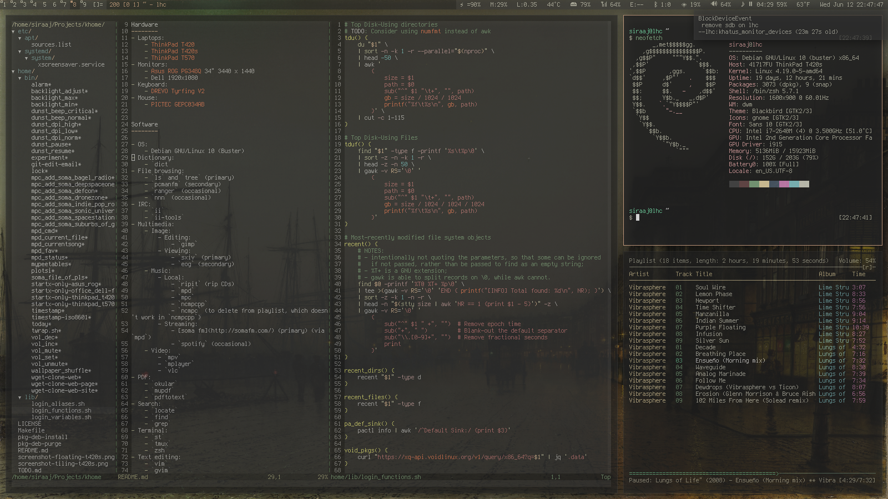

khome
=====

Environment.

Hardware
--------
- Desktop:
  - "citadel" (custom build):
    - board: X570 AORUS PRO WIFI
    - CPU: AMD Ryzen 9 5950X
    - GPU: NVIDIA GeForce GT 1030
    - memory: 32 GB (2 x 16 GB) Crucial Ballistix RGB DDR4 3600
    - storage: 1TB Samsung 970 EVO SSD - M.2 NVMe
    - power: SeaSonic FOCUS Plus 850W
- Laptops:
    - "zondaii" (Dell XPS 13 9300 Developer Edition)
    - "gnush" (ASUS L203M)
    - Purism Librem 15 v4
    - ThinkPad T400
    - ThinkPad T420s
    - ThinkPad T570
- Monitors:
    - Dell Ultrasharp U2718Q 27" 3840x2160 @ 60.00Hz
- Keyboards:
    - Leopold FC750R
    - DREVO Tyrfing V2
- Mice:
    - Kensington SlimBlade Trackball
    - PICTEC GEPC034AB

Software
--------

- OS:
    - Void Linux
    - Debian GNU/Linux 10 (Buster)
    - Ubuntu 18.04
    - Mac OS X 14
- Dictionary:
    - `dict`
- File browsing:
    - `ls` and `tree` (primary)
    - `pcmanfm` (secondary)
    - `ranger` (occasional)
    - `nnn` (occasional)
- IRC:
    - `ii`
    - `ii-tools`
- Multimedia:
    - Image:
        - Editing:
            - `gimp`
        - Viewing:
            - `sxiv` (primary)
            - `eog` (secondary)
    - Music:
        - Local:
            - `ripit` (rip CDs)
            - `mpd`
            - `mpc`
            - `ncmpcpp`
            - `ncmpc` (to delete from playlist, which doesn't work in `ncmpcpp`)
        - Streaming:
            - [soma fm](http://somafm.com/) (primary) (via `mpd`)
            - `spotify` (occasional)
    - Video:
        - `mpv`
        - `mplayer`
        - `vlc`
- PDF:
    - `okular`
    - `mupdf`
    - `pdftotext`
- Search:
    - `locate`
    - `find`
    - `grep`
- Terminal:
    - `st`
    - `tmux`
    - `zsh`
- Text editing:
    - `vim`
    - `gvim`
- Web browsing:
    - `qutebrowser` (primary)
    - `chromium` (fallback)
    - `elinks` (occasional)
    - `ddgr` (occasional small web search)
- X
    - `dwm`
    - `khatus` (currently x2)
    - `dunst`
    - `compton`
    - `xscreensaver`
    - `xbindkeys`
    - `hsetroot` (background color)
    - `feh` (background image)

### Potentially useful

- Desktop search:
    - [doodle](https://grothoff.org/christian/doodle/)
- Email
    - IMAP
        - [imapsync](https://imapsync.lamiral.info/)
        - [isync/mbsync](http://isync.sourceforge.net/)
        - [offlineimap](http://offlineimap.org/)
    - Maildir
        - [syncmaildir](ttp://syncmaildir.sourceforge.net)
- Wayland (if I ever decide to use it)
    - notifications
        - https://github.com/emersion/mako
    - window manager:
        - https://swaywm.org/
        - https://github.com/swaywm/sway

Reading list
------------
- https://wiki.archlinux.org/index.php/Xinit
- https://aur.archlinux.org/cgit/aur.git/tree/?h=xinit-xsession
- https://wiki.archlinux.org/index.php/PCManFM
- https://www.ibm.com/developerworks/library/os-xapianomega/
